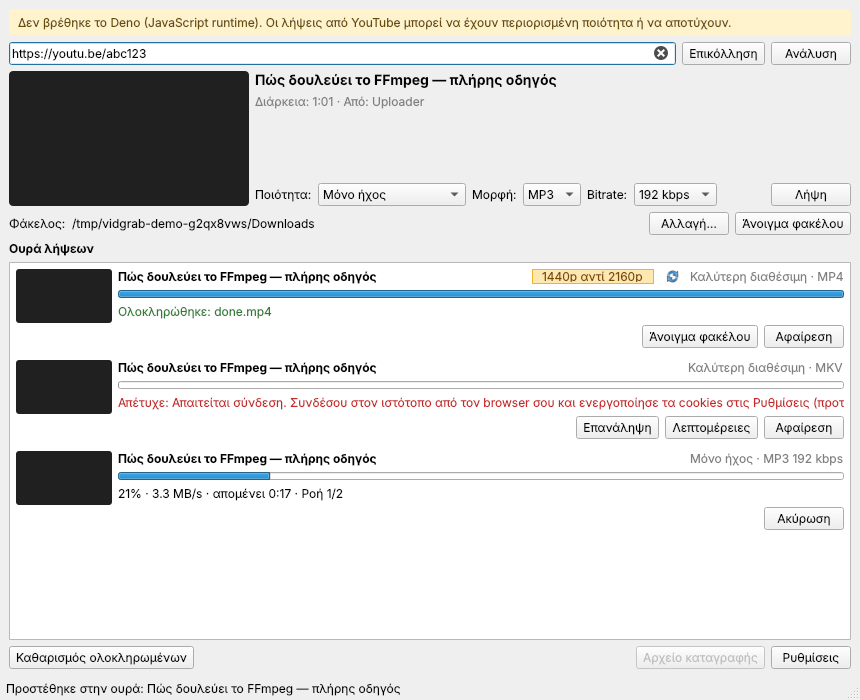

# VidGrab

Windows desktop video downloader for YouTube, X, Facebook and Instagram, built on
[yt-dlp](https://github.com/yt-dlp/yt-dlp) and PySide6.



_Rendered headless (offscreen Qt) with fake data; thumbnails are blank there._

## Features

- Paste a URL to see title, thumbnail and duration
- Quality: Best / 1080p / 720p / Audio only
- Format, chosen next to the quality:
  - video: **MP4** (default; resolution first, then mp4/m4a preferred; if the audio still isn't
    MP4-friendly, only the audio is converted to AAC, never the video) or **MKV** (original streams)
  - audio: **MP3** (128 / 192 / 256 / 320 kbps) or **Original** (m4a/opus, no conversion)
  - the last choices are remembered; each queued download keeps its own
- Download queue with per-item progress, cancel and retry (2 parallel downloads by default)
- Remembered destination folder
- Cookies from Firefox / Chrome / Edge or a `cookies.txt` file (for Instagram/Facebook)
- Clear error messages (private, geo-blocked, login required, ...)
- Log file at `%LOCALAPPDATA%\VidGrab\logs\vidgrab.log`

## Download

Get `VidGrab-<version>-win64.zip` from Releases, extract it, and run `VidGrab\VidGrab.exe`.
FFmpeg and Deno are included.

## Development

```bash
uv sync
uv run pytest
uv run python -m vidgrab
```

See [CLAUDE.md](CLAUDE.md) for conventions.

## Licenses

The bundled FFmpeg build is GPL licensed. Deno is MIT licensed. See their projects for details.
